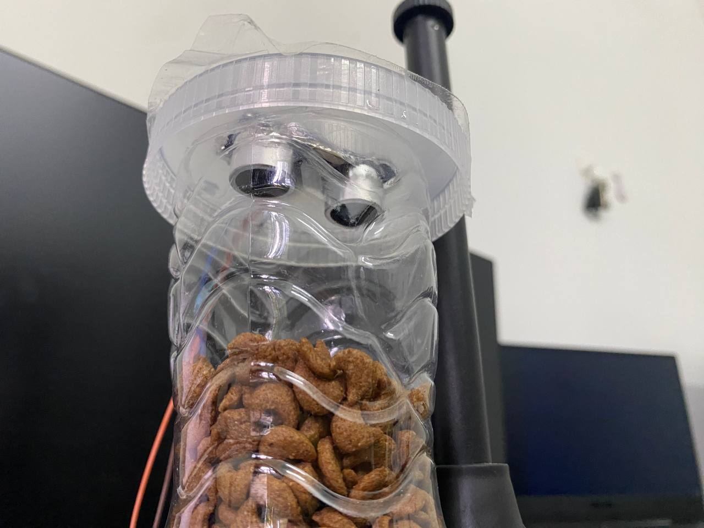
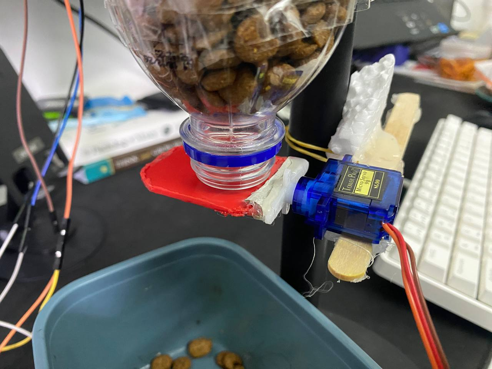
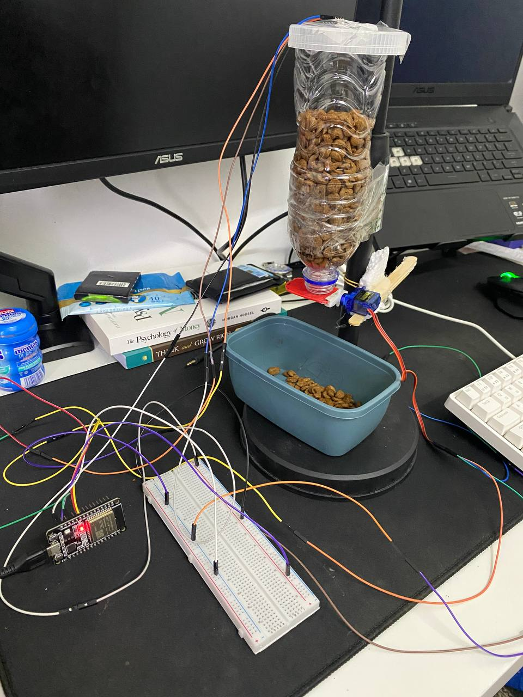

# 🐾 Smart Feeder – IoT Pet Feeding System

Smart Feeder is an Internet of Things (IoT) project developed for an academic assignment, aiming to automate pet feeding using a Telegram bot. It combines the ESP32 microcontroller, an ultrasonic sensor, and a motor mechanism to detect food levels and dispense food on command.

With just a few Telegram commands, you can check if your pet’s food supply is low and activate the feeder remotely!

## 📌 Project Overview

This system offers a smart and convenient way for pet owners to:

- **Monitor food levels** via ultrasonic sensor.
- **Get food status notifications** (Low / Enough) on Telegram.
- **Feed pets remotely** by triggering a motor using the Telegram bot.

## 🤖 How It Works

1. **Ultrasonic Sensor** measures the food level in the container.
2. The system sends a **status update** (e.g., "Low Food", "Food is Enough") to the **Telegram bot**.
3. User sends a **Telegram command** to:
   - Check current food status.
   - Dispense food if needed.
4. When the **"Feed" command** is received, a **motor** rotates to open the bottle cap (via a small plastic plate), allowing food to drop for the pet.
5. The cap closes automatically after feeding.

## 🧠 Features

- 🐱 Remote feeding control using Telegram bot
- 📏 Real-time food level monitoring using an ultrasonic sensor
- ⚙️ Motor-based feeding mechanism
- 🔒 ESP32-based control logic for IoT integration
- 📲 Simple and intuitive Telegram commands

## 🛠️ Components Used

- ESP32 microcontroller  
- Ultrasonic sensor (HC-SR04)  
- Servo or DC motor  
- Plastic bottle & plate (as feeder prototype)  
- Telegram Bot API  
- Jumper wires, power source

## 💬 Example Telegram Commands

/status → Check current food level
/feed → Dispense food (activates motor)
/help → List all commands

## 📷 Prototype Setup

- Bottle with a custom lid
- Motor attached to a plastic plate acting as a feeder gate
- Sensor positioned to measure remaining food in the bottle

## 📦 Future Improvements

- Add real-time camera to monitor the pet.
- Enable automatic feeding based on schedule.
- Use load cell sensor for more accurate food quantity detection.

Youtube Demo Link : https://youtube.com/shorts/hGeAxjq1AQM?si=ipbRWuIuf760F5Rg

