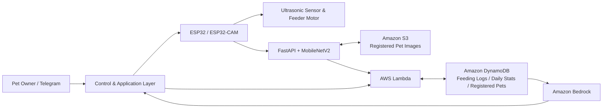

# Smart Feeder — IoT, AWS & AI Pet Feeding Analytics Platform

Smart Feeder is an academic IoT project that evolved from a remote pet-feeding prototype into a broader cloud-connected pet monitoring and analytics concept.

The original prototype combines an ESP32-based feeder, ultrasonic food-level sensing, MQTT communication, and a Telegram bot. A later iteration expanded the solution with pet identification, AWS-backed data processing, and generative-AI analysis.

## Solution Overview

The project was designed around four layers:

1. **Edge & IoT** — ESP32 / ESP32-CAM, ultrasonic sensing, and motor control for feeding.
2. **Application & ML** — Telegram interaction plus Python/FastAPI services and MobileNetV2-based pet identification.
3. **Cloud Data & Automation** — Amazon S3, AWS Lambda, and Amazon DynamoDB for image storage, feeding logs, aggregation, and analysis workflows.
4. **AI Insights** — Amazon Bedrock for generated feeding and pet-health summaries based on collected data.

## Architecture


```mermaid
flowchart LR
    U[Pet Owner / Telegram] --> C[Control & Application Layer]
    C --> E[ESP32 / ESP32-CAM]
    E --> S[Ultrasonic Sensor & Feeder Motor]

    E --> M[FastAPI + MobileNetV2]
    M <--> S3[Amazon S3\nRegistered Pet Images]

    C --> L[AWS Lambda]
    M --> L
    L <--> D[Amazon DynamoDB\nFeeding Logs / Daily Stats / Registered Pets]
    D --> B[Amazon Bedrock]
    B --> C
```

> The diagram represents the expanded solution architecture. This public repository currently contains the original IoT/Telegram implementation and project media; not every later cloud-side component is published here.

## Core Capabilities

- Remote feeding through Telegram commands.
- Food-level monitoring using an ultrasonic sensor.
- MQTT-based communication between the application layer and IoT device.
- Camera-assisted pet identification using MobileNetV2.
- Registered-pet image storage using Amazon S3.
- Feeding-event and pet-data persistence using Amazon DynamoDB.
- Serverless processing and aggregation using AWS Lambda.
- AI-assisted weekly health summaries and monthly feeding forecasts using Amazon Bedrock.

## AWS Components

| Service | Role in the solution |
| --- | --- |
| **Amazon S3** | Stores registered pet image datasets used for recognition workflows. |
| **AWS Lambda** | Handles serverless feeding-log, aggregation, analysis, and health-processing workflows. |
| **Amazon DynamoDB** | Stores feeding logs, daily statistics, and registered-pet records. |
| **Amazon Bedrock** | Generates higher-level pet feeding and health insights from collected data. |

Example DynamoDB entities used in the expanded design include:

- `PetFeedingLogs`
- `FeedDailyStats`
- `RegisteredCats`

## Original IoT Prototype

The initial version in this repository focuses on the physical feeder and Telegram-based remote control:

1. The ultrasonic sensor measures the current food level.
2. The ESP32 communicates device data through MQTT.
3. The Telegram bot accepts commands such as feeding and food-level checks.
4. A motor/servo mechanism opens the feeder gate when a feed command is received.
5. Status information is returned to the user through Telegram.

### Main Hardware

- ESP32
- Ultrasonic sensor
- Servo / motor feeding mechanism
- Prototype food container
- ESP32-CAM in the expanded iteration

## Technology Stack

**Cloud:** AWS Lambda, Amazon DynamoDB, Amazon S3, Amazon Bedrock  
**AI / ML:** Python, MobileNetV2  
**Application / API:** Python, FastAPI, Telegram Bot API  
**IoT:** ESP32, ESP32-CAM, MQTT, ultrasonic sensor, motor/servo control

## Project Ownership

I defined the project concept, functional requirements, solution architecture, data flow, integration approach, and expected user experience. AI-assisted development tools were used during parts of the implementation to accelerate coding, while I remained responsible for the solution decisions, integration, debugging, validation, and overall project direction.

## Recognition

**Top 3 / Bronze — UniSZA MPI**

## Repository Scope

This repository preserves the original academic IoT prototype and its demo assets. The AWS/AI architecture documented above represents the later evolution of the project. Some cloud-side implementation components are not currently included in this public repository.

## Security

Runtime credentials should be supplied through environment variables and must not be committed to source control.

Required variables for the Telegram/MQTT prototype:

```bash
TELEGRAM_BOT_TOKEN=
FAVORIOT_MQTT_USER=
FAVORIOT_MQTT_PASS=
FAVORIOT_DEVICE_ID=
```

## Demo

Original prototype demo:  
https://youtube.com/shorts/hGeAxjq1AQM?si=ipbRWuIuf760F5Rg

---

Developed as part of my Software Engineering studies at Universiti Malaysia Terengganu (UMT).
